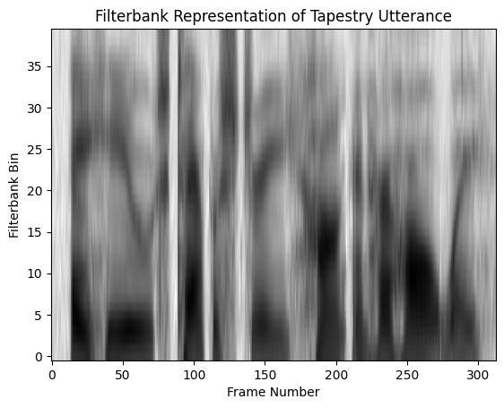
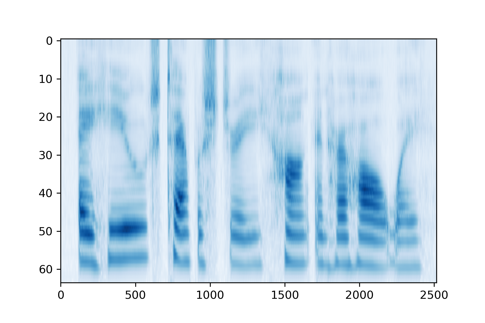

# Python Auditory Toolbox

This is a Python port of (portions of) the 
[Matlab Auditory Toolbox](https://engineering.purdue.edu/~malcolm/interval/1998-010/). 
This package provides code built upon the 
[Numpy](https://numpy.org/doc/stable/index.html), 
[PyTorch](https://pytorch.org/), and 
[JAX](https://jax.readthedocs.io/en/latest/notebooks/quickstart.html) 
numerical libraries.

The Python Auditory toolbox includes these functions from the original in Matlab:
- Patternson-Holdworth ERB (Gammatone) Filter Bank
  - MakeErbFilters
  - ErbFilterBank
- Correlogram Processing
  - CorrelogramFrame
  - CorrelogramArray
  - CorrelogramPitch
- Demonstrations
  - MakeVowel
  - FMPoints 
  - Spectrogram

This toolbox does not include Lyon's Passive Long-wave Cochlear model as this model
has been supersceded by [CARFAC](https://github.com/google/carfac).

All functions are available on top of any of these three computational libraries: 
[JAX](https://github.com/google/jax), 
[NumPy](https://numpy.org/) or 
[PyTorch](https://pytorch.org/).

[This colab](https://colab.research.google.com/drive/1JGm24f1kOBl-EmtscJck58LGgWkfWGO8#scrollTo=1dB7di7Nv622)
provides examples of calling (and testing) this libary using the NumPy functionality.

This toolbox can be used to build biophysically inspired models of the auditory periphery using JAX, 
PyTorch and NumPy. This can hopefully be used to further develop realistic models with better explanations of 
what is changing as we optimize to match different psychoacoustic tests. It may further be useful for developing 
auditory models such as those developed in Sarah Verhulst's 
([Hearing Technology Lab on GitHub](https://github.com/HearingTechnology)) 
and Josh McDermott's 
([Model Metamers Paper](https://www.nature.com/articles/s41593-023-01442-0)) labs.

You can include the python_auditory_toolbox in your work in several ways.  Via the Python package installer:

	pip install python_auditory_toolbox

From GitHub at:

	https://github.com/MalcolmSlaney/python_auditory_toolbox

Or see the toolbox in action (with pretty pictures) via Colab at:

	https://colab.research.google.com/drive/1JGm24f1kOBl-EmtscJck58LGgWkfWGO8?usp=sharing

## Note
This package includes three different implementations of the auditory toolbox and thus the union
of the three different import requirements. Most users will probably be only using
one of the three libraries (NumPy, JAX, or PyTorch), will only need to import one of the 
auditory_toolbox files, and will not need all the prerequisite libraries.

Please cite this work as:

	Malcolm Slaney and Søren Fuglsang, Python Auditory Toolbox, 2023. https://github.com/MalcolmSlaney/python_auditory_toolbox. 
  
## Examples
Here are the frequency responses for a 10-channel ERB gammatone filtebank.


Here is an example of a correlogram, here with a number of harmonic examples 
that demonstrate the correlogram representation.
<video src="python_auditory_toolbox/examples/DudaVowelsCorrelogram.mp4" controls title="Correlogram Example"></video> 
or via [YouTube](https://youtu.be/kTqhfxHPcVo)

MFCC (mel-frequency cepstral coefficients) is a classic speech representation
that was often used in (pre-DNN) speech recognizers. 
It converts the original spectrogram, shown here, 


into a 40 channel filterbank.  And finally into a 13-dimensional cepstral representation.  

We can invert these steps to reconstruct the original filterbank representation



And then the reconstruct the original spectrogram.


Note, in particular, the pitch harmonics (the horizontal banding) have been 
filtered out by the cepstral processing.

## Examples: PyTorch
The following code block demonstrates a feature extraction scheme that involves a 
64-channel ERB gammatone filterbank. While the NumPy and JAX versions mimic the original
Matlab API, the PyTorch version defines a class. The output features are shown below.

```python
import torch
import torchaudio
import matplotlib.pyplot as plt
import auditory_toolbox_torch as pat

class CustomPipeline(torch.nn.Module):
  def __init__(self, sampling_rate: int = 16000) -> None:
    super().__init__()
    self.erbbank = pat.ErbFilterBank(sampling_rate,64,100)
    self.relu1 = torch.nn.ReLU()
    self.avgpool1 = torch.nn.AvgPool1d(80, stride=20)

  def forward(self, x: torch.Tensor) -> torch.Tensor:
    x = self.erbbank(x)
    x = self.relu1(x)
    x = self.avgpool1(x)
    x = torch.pow(x,0.3)
    return x
  
wav, fs = torchaudio.load('./examples/tapestry.wav')

pipeline =  CustomPipeline(fs)
pipeline.to(dtype=torch.float32)

fig = plt.figure()
plt.imshow(pipeline.forward(wav).squeeze(), aspect='auto', cmap='Blues')
```



## Authors
Malcolm Slaney (malcolm@ieee.org) and
Søren A. Fuglsang (sorenaf@drcmr.dk)
